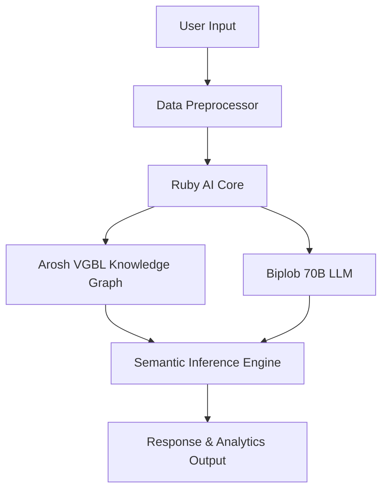

Ruby AI – Intelligent Evolution Platform

   

Ruby AI is a cutting-edge artificial intelligence framework for building, training, and deploying scalable AI systems. It powers multi-modal reasoning, predictive analytics, and human-centric AI tools through an advanced ecosystem of models.

---

Table of Contents

Overview

Features

Architecture

Data Models

Core Components

Roadmap

Installation

Usage

Contributing

License

---

Overview

Ruby AI combines Arosh VGBL (graph-based learning) and Biplob 70B (a 70-billion parameter large language model) to deliver:

Next-gen language reasoning & knowledge graphs

Real-time data intelligence at scale

Flexible APIs for developers and researchers

---

Features

Plug & Play AI Models – Load models like Biplob 70B instantly.

Multi-modal AI – Text, vision, structured data support.

Distributed Inference – Scale from local to cloud clusters.

Human-friendly API – Simple integration with Python, JS, and Go.

---

---

Data Models

Usage Distribution

pie title Ruby AI Data Model Usage
    "Arosh VGBL" : 40
    "Biplob 70B" : 50
    "Auxiliary Models" : 10

Arosh VGBL: Graph-based semantic learning module.

Biplob 70B: Advanced LLM for reasoning & generation.

---

Core Components

Arosh VGBL

Dynamic knowledge graph construction

Semantic search & entity linking

Self-updating contextual networks

Biplob 70B

70-billion parameter LLM

Capable of reasoning, creative generation, and deep context understanding

---

Roadmap

[x] Core AI engine

[x] Biplob 70B integration

[ ] Fine-tuning API

[ ] Web-based Admin Dashboard

[ ] Mobile SDK (iOS/Android)

[ ] Auto-scaling on Kubernetes

---

Installation

# Clone the repository
git clone https://github.com/yourusername/ruby-ai.git
cd ruby-ai

# Install dependencies
pip install -r requirements.txt

---

Usage

from ruby_ai import RubyCore

# Initialize with Biplob 70B
ai = RubyCore(model="biplob-70b")
print(ai.generate("Summarize the theory of relativity."))

---

Contributing

We welcome contributions! Please read CONTRIBUTING.md for details.

Fork the repo

Create a new branch

Submit a pull request

---

License

Licensed under the MIT License – see LICENSE for details.

---
